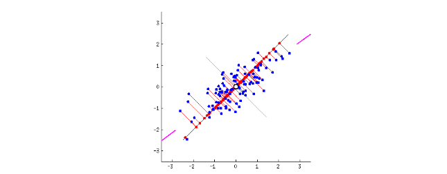

Sometimes your data has a whole heap of variables that are extraneous to the main model. They almost represent the same thing (what is the term for that?), which suggests that we should be able to compress our regression models, if we can find a way to only use the *principle components* of the dataset. What exactly do I mean by that?

##Principle Components Analysis (PCA)

Consider this image that I have copied from https://stats.stackexchange.com/questions/2691/making-sense-of-principal-component-analysis-eigenvectors-eigenvalues/140579#140579 (Go have a look at the real thing - it rotates! And the post itself is a great resource if you are trying to understand how PCA works.)



Here we see a dataset (the blue dots) that has a very definite trend. Instead of using the (x, y) coordinate system to map it, we could use Principle Components Analysis (PCA) to rotate our basis, changing how we refer to each point in the dataset by using  its *two Principal components*.  But what precisely are these?

PCA  generates *new* components which summarise the data in the *best possible way*. To find the first principal component, we define "best possible" as the representation that has the biggest variation in values along the red line while minimising the error of the fit. We rotate the red line until we find that point. Where does it occur? (Anything familiar to a method we have seen earlier in this subject?)

The next principle component is defined by finding the a line orthogonal to the first one that describes the largest amount of variation that is remaining in the dataset. Because we started out with two dimensions, these two components fully map out our data. We can redraw it according to our two components! 

If you want to try visualising PCA more just to get a bit more of a understanding of what is going on here, then this page will be very useful:

* http://setosa.io/ev/principal-component-analysis/

Let's get started with actually *doing* some PCA then!

A lot of the examples on the web about PCA (and many other things) use the iris dataset. Let's have a look at it.

```{r}
iris
```

Right-o. This dataset describes some flowers, and how big they are along various dimensions for 3 different species (remember you can get the help pages about the dataset in this way: `?iris`). Let's try plotting it to get an idea of how it looks.

```{r}
library(ggplot2)
ggplot(iris) + geom_point(aes(x=Sepal.Width,y=Petal.Length,color=Species))
```

So we can see three quite distinct clusters if we play around with it the right way (and this dataset is often used to teach people about clustering for precisely this reason). Why don't you do a bit of Exploratory Data Analysis and see if you can work out other things about this dataset? Hint... here is an example of how it ranges over all variables... (Check out this page if you want more ideas from base r: https://machinelearningmastery.com/data-visualization-in-r/ Just as a test of your skills - can you work out how to do the same things using ggplot?)

```{r}
pairs(iris,col=iris$Species)
```

So. The question becomes - can we break this dataset down into principal components? How would we do this? 

Base R has a fairly decent function for doing PCA: the `prcomp` function. Let's try it out.

*Warning 1:* If you go and have a look at this page: https://stats.stackexchange.com/questions/164381/why-log-transforming-the-data-before-performing-principal-component-analysis, then you will find out that it is often a good idea to both scale and log transform a dataset before doing PCA to remove trivial effects. We will not do that here as it is not necessary, but you should always make sure you are familar with your data before doing PCA and know if you need to scale it! 

*Warning 2:* It is also important to consider scales and to center your datasets, as otherwise the variables you are most interested in might wash out due to trivialities. Here is another page with some good discussion on this problem: http://www.win-vector.com/blog/2016/05/pcr_part1_xonly/)

```{r}
# applying PCA - scale. = TRUE is highly advisable as otherwise arbitrary scales can dominate, but the default in prcomp is FALSE, centre on the other hand defaults to TRUE - look up the help page!
iris.pca <- prcomp(iris[c(1, 2, 3, 4)], scale. = TRUE) #removing the categorical data as it wont work - PCA only works on numeric values
print(iris.pca)
```


Ok. But what does that actually mean? Try running `?print.prcomp` to get the help page. Essentially this plot lists off the 4 principal components that have been found and shows, them in decreasing order of influence. If you read the `prcomp` page then it also tell you about what is actually going on. Our function has broken our data matrix into 3 new components (i.e. it has factorized it!) Check out the return values: there is a `rotation` and a value (`x`). What do they look like?

```{r}
# tells us what was actually returned by prcomp 
names(iris.pca) 
```

```{r}
#we can then find out the values in these variables in the following way
iris.pca$rotation
head(iris.pca$x)
```

Ok! The PC bits are the principal components that describe the new basis that we are using to describe our data. 

* `rotation` is a matrix of the principal component loadings (these are the eigenvectors if you know anything about the SVD process that is being used by PCA). So this tells us how to recover the original values for our data in a linear combination of the components
* The matrix `x` has the principal component score vectors

If we combine these two things then we can recover our original data! Thus, our dataset has been *factorized* into two new matrices that we can use to recover the original data. 

* This page gives more information about how you can interpret these values: https://www.analyticsvidhya.com/blog/2016/03/practical-guide-principal-component-analysis-python/
* See this page for more details too, along with a nice proof of the equivalence between PCA and SVD using R: https://poissonisfish.wordpress.com/2017/01/23/principal-component-analysis-in-r/. 

What does all this look like? 
Let's try plotting the results of the PCA to see what it gave us:

```{r}
plot(iris.pca, type = "l")
```

So this is giving us information about how much the various principal components contribute to the explanation. PC1 contributes the most (these are always ordered because of how SVD works), with the amount explained by the later PCs gradually falling off. Note that we could probably get *most* of our variance explained by two principal components according to this graph. This already gives us an indication of how PCR is likely to work... essentially we could cut off the last two components and still explain *most* of the variance in our data. Can we see how this works more visually?

But can we see more? There is a nice function in `ggplot2` that we can use for this. `autoplot` generates a plot appropriate to a datatype - if we install a package called `ggfortify` let's try it out:

```{r}
library(ggfortify)
autoplot(iris.pca)
```

Ok.. but a bit hard to interpret. We can find out more if we do a similar thing but keep the original dataframe with its categorical data. 

```{r}
autoplot(prcomp(iris[c(1, 2, 3, 4)]), data = iris, colour = 'Species')
```

Ha! So now we have a representation where most of the setosa flowers are described at one value for PC1, most of the versicolor at another, and the virginica at another. It looks quite good actually as a descriptor of most of the variance :)

Lets do that again but include the loadings as well:

```{r}
autoplot(prcomp(iris[c(1, 2, 3, 4)]), data = iris, colour = 'Species',
         loadings = TRUE, loadings.colour = 'blue',
         loadings.label = TRUE, loadings.label.size = 3)
```

Cool. Now we can see the loadings on the same plot :) To get any further though we will probably have to do a PCR. 

###More information

* A very nice page describing PCA: https://poissonisfish.wordpress.com/2017/01/23/principal-component-analysis-in-r/
* Here is another page that gives some other ways of visualising PCA: https://tgmstat.wordpress.com/2013/11/28/computing-and-visualizing-pca-in-r/
* This is a nice page describing how you can plot both PCA 
and other clustering methods using `ggfortify`: http://rpubs.com/sinhrks/plot_pca
* Just in case you want to learn python, here is a nice example of PCA using the iris dataset in python! http://sebastianraschka.com/Articles/2015_pca_in_3_steps.html (Try it and get started!)

##Principal Components Regression (PCR)

The basic idea behind PCR is to calculate the principal components of a dataset using PCA and then use some of these components as predictors in a linear regression model fitted using our typical least squares procedure. 

More technically, PCR uses PCA to decompose the independent ($x_i$) variables in our model into an orthogonal basis (the principal components), and select a subset of those components as the variables to predict our dependent variable $y$. We use the ones that are most predictive down  to a threshold cut (normally a value of the eigenvector that we do not want to go below). 

Why would we want to do this type of thing? Here are a few of the advantages:

* Dimensionality reduction
* Avoidance of multicollinearity between predictors (PCR is a good way of removing it!)
* Overfitting mitigation

PCR is not really a variable selection proceedure though, as each of the components in the original model are still in the new compressed variables. However, is can significantly reduce the complexity of your model, and sometimes it will even give you new insights. 

***However*, the outputs of PCR can be very difficult to interpret**. That is because the new principal components may not correspond to anything that looks like something in the original dataset. We saw that above with the new basis vectors that we drew on the plot of the `iris` dataset. They are no longer things like `Sepal.width` and `Petal.length`; the basis vectors now point in very different directions in our high dimensional space... Sometimes however, this rewriting of the basis can yield great new insights - see http://setosa.io/ev/principal-component-analysis/ for some lovely intuitive examples. 

The `pls` package is an easy to use R package for performing PCR, so this is the one we are going to use here. There are a number of other packages available (e.g. some of you may have used caret already which has PCR capabilities, and the base-R stats package has a `prcomp` function too) but here we will focus on `pls`. 


```{r}
library(pls)
set.seed (1000) # this is just so that we can reproduce our results in what follows if we want - the seed drives random variables that are chosen by various R functions
```

There is a detailed manual on pls available here: https://cran.r-project.org/web/packages/pls/vignettes/pls-manual.pdf.  
It has lots of examples and information if you want to find out more about using `pls`. Once you have finished working your way through though here it would be a good idea to go and have a look at the manual. 

Let's try it out on our sepal data 

```{r}
pcr.sepal <- pcr(Sepal.Length~., data = iris, scale = TRUE, validation = "CV")
summary(pcr.sepal)
```

So. This `summary` produces two core results: the validation error of the cross-validation and the cumulative percentage of variance explained using however many principal components (1-5 in this case). The idea is to maximise the amount of variance you can explain while minimising the error. 

Is the `pcr` model any better than what we could have gotten using a linear model? Probably not in this case (check it!) but it does help us to illustrate the basic architecture. In a while we will do all this with a more complex example. For now, let's keep going with some model diagnostics to find out more about how the model is working.

We do this with the `validationplot` function, which tells us about the validation statistics of our regression model and how they depend upon the number of components we are choosing, Let's try one:

```{r}
validationplot(pcr.sepal)
```

Here, we see that as we incorporate more principal components into our model the error decreases. How low does it need to be? Well that is more of an art again. Remember we are trying to maximise the explanatory power of our model while minimising error? Let's look at $R^2$ while varying the number of principal components and see how it changes:

```{r}
validationplot(pcr.sepal, val.type = "R2")
```

In this case, it looks like 3 components are enough to explain more than 90% of the variability in the data! We don't need all 6 that came with it, although the error is a little lower with 4 or 5 components, so it is a bit of a trade off. What do you think is the optimal choice?

Well... R thought 5, so let's see well the predicted values of the model overlap with the measured values:

```{r}
predplot(pcr.sepal)
```

Looks pretty linear which is encouraging! If you want to actually test the model then you would need to have split it into a train/test set and then cross validate it. I leave that as an exercise for you (go back and look at the regression workbook for one example of how to do this.)

###Something more complex (and Partial Least Squares Regression - PLSR)

Now, lets practice with something more complex, which is where PCR often starts to shine. And let's do something a little bit different too. We will work with the gasoline dataset which contrasts of octane number (octane) and NIR spectra (NIR) of 60 gasoline samples. The NIR spectra consist of 401 diffuse reflectance measurements (from 900 to 1700 nm).  

You can find out a little bit more about this dataset by running this command:

```{r}
?gasoline
```

Lets have a bit of a look at it:

```{r}
str(gasoline)
```

Plotting it takes a bit of an effort because of the structure:

```{r}
data(gasoline)
par(mar = c(2, 4, 1, 0) + 0.1)
matplot(t(gasoline$NIR), type = "l", ylab = "log(1/R)", xaxt = "n")
ind <- pretty(seq(from = 900, to = 1700, by = 2))
ind <- ind[ind >= 900 & ind <= 1700]
ind <- (ind - 898) / 2
axis(1, ind, colnames(gasoline$NIR)[ind]) 
```

 (Running `?matplot` should give you a decent idea of what is going on here.)
 
Right! Let's do our PCR properly this time. We need to split our data into training and testing sets:

```{r}
gasTrain <- gasoline[1:50,]
gasTest <- gasoline[51:60,]
```

We are going to fit a Partial Least Squares (PLS) Regression model to this dataset instead of using PCR (check out the wikipedia page: https://en.wikipedia.org/wiki/Partial_least_squares_regression). In essence PLS projects the predicted variables and the observable variables to a new space, instead of finding  hyperplanes of maximum variance between the response and independent variables like PCR. 

Both of them are ways of linearly decomposing a matrix however. 

You should try all of these steps with a second model based off of the `pcr` method too - then you can compare them how well they both work!)

```{r}
gas1 <- plsr(octane ~ NIR, ncomp = 10, data = gasTrain, validation = "LOO")
#here is the second model using pcr - I leave it for you to try it out in the following steps
#gas2 <-pcr(octane ~ NIR, ncomp = 10, data = gasTrain, validation = "LOO")
```

Yep - it is that easy. You can find out a lot more about the options availble in the `plsr` function with `?plsr`. For example, you can use cross validation ("CV") instead of LOO, or you can choose to do no validation ("none") 

In this fit we have fit a  model  with  10  components,  and included leave-one-out ("LOO")  cross-validated predictions. As is normal, we can get an overview of the fit and validation results with the summary method:

```{r}
summary(gas1)
```

The validation results here are Root Mean Squared Error of Prediction (RMSEP). So what do you think it is telling you? The number of components is a choice we have made in constructing the model, what is a good optimal number to describe most of the variance in the data? Ideally we would choose a number of components that gives us a good description of the variation in the dataset without choosing too many of them.. what do you think is the best choice? 

You can find out more about the rest of these details by looking at the manual. 

Normally it is easier to estimate the number of components needed by looking at a graphical depiction of how the RMSEP varies with the number of components in a diagnostic plot that helps us to understand if the PCA is any good. 

```{r}
plot(RMSEP(gas1), legendpos = "topright")
```

So how many components do we need to explain the bulk of the variance in the model? Discuss this with someone next to you... and if you want more info then you should go and have a look in the manual which has a lot more details. 

Lets say we choose 2 components (why did we do that?) We can then make a predictive plot that attempts to  inspect different aspects of the
fit. 

```{r}
plot(gas1, ncomp = 2, asp = 1, line = TRUE)
```

Hmm - seems to look pretty good. But there is a lot more you can do here. For example, because we know the true response values for these samples,  we can calculate the test set RMSEP:

```{r}
RMSEP(gas1, newdata = gasTest)
```

Would you change your mind about how many components to choose now? (NB: For two components, we get 0.244, which is quite close to the cross-validated estimate above (0.297).)

A  fitted  model  is  often  used  to  predict  the  response  values  of  new  observations. The following predicts the responses for the ten observations in gasTest, using two components:

```{r}
predict(gas1, ncomp = 2, newdata = gasTest)
```

What do you think? How could you test whether the predictive model is any good? Really you need to compare the above result with this:

```{r}
gasTest$octane
```
Why dont you chat at your table to come up with a good measure of how well the model is working here... 

One more thing that is worth noting. PCA is essentially a wholistic model, so this model is generating a spectrum for each component. What do they look like?

```{r}
plot(gas1, "loadings", comps = 1:2, legendpos = "topleft",labels = "numbers", xlab = "nm")
abline(h = 0)
```

So basically this reduced model is trying to represent our original spectrum (remember that nice coloured line?) as a weighted sum of these two compoents! Cool. What do you think it will miss?

What if we want to look at the model more compoents? We can use coefplot, but it gets busy quickly...
 
```{r}
coefplot(gas1, ncomp=1:6)
```

Or we could use this setting to split them up:

```{r}
coefplot(gas1, ncomp=1:6, separate=TRUE)
```


Try modelling a few more (how would you do that?), and compare them with the first graph that we made above. Then try to explain what is going on to the person sitting next to you.

###More information

* The pls manual is a great place to start (indeed - I took the above exercise from the beginning of that manual) https://cran.r-project.org/web/packages/pls/vignettes/pls-manual.pdf 
* This page does a lovely job looking into the intricacies of PCR, showing how its dependence on an "x-only" decomposition is sometimes a weakness, and what you can do to fix that: http://www.win-vector.com/blog/2016/05/pcr_part1_xonly/ It also discussess the necessity of making sure your data is well scaled and how to do that. (You can find the other posts in this 3 part series here: http://www.win-vector.com/blog/2016/06/why-you-should-read-nina-zumels-3-part-series-on-principal-componexnts-analysis-and-regression/ - highly recommended!)
* The article that announced the pls package: https://www.jstatsoft.org/article/view/v018i02/v18i02.pdf

##Non-negative Matrix Factorization (NMF)

You need a new package to run this method

```{r}
library(NMF)
```
Now we are going to move onto a very quick discussion of a more interpretable matrix factorization method. I will explain how that works in a little bit. But first, lets find a big dataset that we want to compress. Images are normally a pretty good option for that! I am going to try it with an image of me(!), but you could use anything you like. 

Right - first we need to convert our image to ppm format so that R can read it in. You can do this online (e.g. use this site: https://convertio.co/jpg-ppm/)


```{r}
library(pixmap)
kirsty<-read.pnm("KittoPhoto.ppm")
```

Ooooo - I have been digitised!

What is in there?

```{r}
class(kirsty)
str(kirsty)
```

*What is that???* Basically its a S4 object. These are used by R to represent complex data like maps, images etc. You can find out a bit about them in this book: http://adv-r.had.co.nz/OO-essentials.html, although you might find that book a bit technical at this stage... its well worth working your way through it! (Although I have to admit that I just dip in  and out of it when I need to learn things myself :) 
One of the best ways to get a gentle introduction into actually *using S4 objects* would be to do this data camp course: https://campus.datacamp.com/courses/working-with-geospatial-data-in-r/basic-mapping-with-ggplot2-and-ggmap (I am recommending it for the workbook on geospatial analysis too, so you could learn two sets of advanced things at once!)

Lets try extracting just a subset of the information in this thing:

```{r}
kirstydata<-kirsty@red
plot(kirstydata)
```

That's not me! This is though :) 

```{r, cache=TRUE}
image(kirstydata)
```
Basically you have to tell R to render the data as an image :D

That image took my computer a LONG time to render. And it is just the red bit of the RGB array! But we now see an image of me in R! Cool. 

And now, can we factorise me using NMF? (I have to admit I can be larger than life... sometimes it is worth trying to compress me a little ;) 

NMF works almost like PCA, but it requires the weights matrix to be positive. That makes it easier to interpret the results, as the weights can be mapped onto *probabilities*, which in turn means that instead of thinking of the other matrix as a rotation, you can think of it as a set of components (or naturally defined features in your dataset). This paper gives a very nice explanation of the differences, and how NMF works: http://www.columbia.edu/~jwp2128/Teaching/E4903/papers/nmf_nature.pdf (indeed, while the technique had been around for quite a while, that paper made it famous!)

Let's try a factorization rank of 10 - that is going to be pretty bad, for an image of this size, but it does converge in a sensible amount of time. (Bigger ranks take longer to converge! If you are impatient then you should try a lower number!)

```{r, cache=TRUE}
kirsty.compressed<-nmf(kirstydata,10)
kirsty.compressed
```

```{r, cache=TRUE}
weights <- kirsty.compressed@fit@W
h <- kirsty.compressed@fit@H
approximate.kirsty<-weights %*% h
image(approximate.kirsty)
```

And there I am... Somewhat smaller and easier to render :)

What about the weights? Can we render them? Yes! But in this case what we get is not terribly interpretable:

```{r}
basismap(kirsty.compressed)
```

```{r}
coefmap(kirsty.compressed)
```

Try to work out what is going on here... can you work out how these two matrices contribute to the picture of me that we just produced? This page gives a bit of an example for text analysis: http://tech.opentable.com/2015/01/12/finding-key-themes-from-free-text-reviews/ (although the code is in python). The other resource that you could look to is the that paper on "learning the parts of wholes" (http://www.columbia.edu/~jwp2128/Teaching/E4903/papers/nmf_nature.pdf).

###More information

* A tutorial: http://heather.cs.ucdavis.edu/NMFTutorial.pdf
* https://cran.r-project.org/web/packages/NMF/vignettes/NMF-vignette.pdf
* An extensive set of slides from a tutorial: http://www.cs.rochester.edu/u/jliu/CSC-576/NMF-tutorial.pdf (Also has some nice stuff on PCA)
