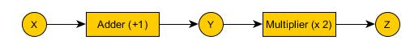
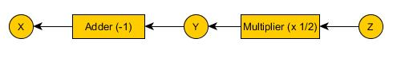
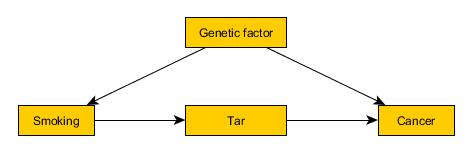
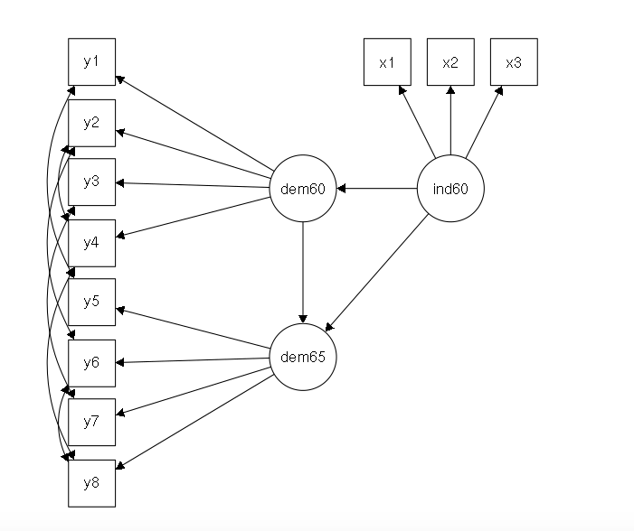

How many times have you heard the slogan: "correlation does not imply causation"? 

This saying is really just saying that just because two events always come one after the other, it doesn’t mean that the first event *caused* the second. (That is, the rooster crowing does not *cause* the sun to rise!)

This is a real problem, in particular for AI. If we tell a robot both:

1.    If the grass is wet, then it rained ($GW\rightarrow R$); and 
1.    If we break this bottle, the grass will get wet ($BB\rightarrow GW$).

Then it may well conclude that if it breaks the bottle then it will have rained! ($BB\rightarrow R$). This is not something that we want a robot to conclude, and even less something we want it to do! 

Well there is a bit of a revolution that has been occuring in the last 30 years, which mainly came out of AI, due to the work of Judea Pearl. He showed that sometimes, when we have information about how correlations change in time, we *can* start to infer causal information from our data. A really nice background piece to this work (and what it means for AI) can be found here: https://www.quantamagazine.org/to-build-truly-intelligent-machines-teach-them-cause-and-effect-20180515/  

It is hard to overestimate how important causality is in data analysis! Most questions in the health, social and behavioural sciences are not associational but *causal*. People want to know things like:

* Did a cut in funding to public housing cause an increase Sydney house prices?
* Does obesity cause diabetes?
* Will an increase in public transport services on Friday nights lead to reduced road deaths?
* Will user satisfation increase if this new feature is added?
* Is a company guilty of discrimination in its hiring practices?
* What was the cause of death of an individual?

These questions cannot be answered from the data alone, or of the distributions that govern that data. They require some knowledge of the data-generating process, and in particular, of *how that process changes in time*.

Thus, causal analysis aims to infer not only beliefs or probabilities under static conditions, but also to understand how they will change. For example,  changes induced by treatments or external interventions in a system. 

This type of problem requires extensions to the standard language of statistics, and this extra mathematical apparatus is relatively new (having been largely developed by Judea Pearl in the 1980's). This means that these technical extensions are not widely known about in the fields that could put them to best use. Here, we will just start to explore these issues in very shallow detail (but hopefully enough to whet your interest!) Make sure you follow up the links in this workbook, and <a href="https://canvas.uts.edu.au/courses/390/modules/items/32423">on Canvas</a> for extra information if you would like to pursue this line of thinking for Assessment 3. 

Right, what if we have a thing that works by taking a variable X, and doing some stuff to it in the following sequence. 



We could represent this process with the two equations:

$Y = X + 1$<br>
$Z = 2Y$

Are they equivalent? Actually, Pearl argues no. He says that if you rearrange the equations like this:

$X = Y – 1$<br>
$Y = Z/2$

which is a fine thing to do according mathematics, then you actually get something that goes backwards



That means that if you do something that changes $Y$ in both situations, then while the equations give you the same thing, the diagrams would give you something different! Pearl claims that the diagrams are more useful, as they help us to answer questions like the ones I was asking above. 

Pearl says that $Y$ can be said to cause $Z$ if performing "surgery" on $Y$ (ie. changing the value of $Y$ in an equation) can change the value of $Z$. That is precisely the case in the above graph! Not so for $X$ though... changing the value of $Y$ has no effect on $X$. 

Pearl introduces a new operator $do()$ to standard probability theory. This operator allows us to distinguish between an association, and actually *doing* something. If you want to see some details about how this operator works then you should go and check out this page for a brief introduction: https://formalisedthinking.wordpress.com/2010/08/26/a-causal-calculus-processing-causal-information/ (this is a very nice sequence of posts on the topic!)

Let's think how this works via an example Pearl used about smoking, this statement: *Smoking causes lung cancer via the intermediary of building up tar deposits in the lungs. There is also a genetic feature that both increases the chance of developing cancer and increases the chance of a person taking up smoking.*

Here is a causal graph illustrating that statement:



The problem is then to determine the *strength* of the connections between the nodes: the probability of cancer given $do(smoking)$.

We are not going to work through this, instead we are going to learn how to use the apparatus of Structural Equation Modelling (SEM) to pull out probabilities like these. If you want to find out more then you should definitely work through some of the resources below! (It will be challenging but rewarding!)

**Update:** A fantastic new blog post on this do calculus with respect to ML has just appeared! Its a crackingly good place to start learning about Pearl's calculus: http://www.inference.vc/untitled/ 


###More information

* A really nice place to start is this sequence of blog posts by someone exploring Pearl's classic book on this subject: https://formalisedthinking.wordpress.com/2010/08/20/pearls-formalisation-of-causality-sequence-index/
* Week 5, parts h-j (on model building) of the Statistical Thinking for Data Science MOOC: https://courses.edx.org/courses/course-v1:ColumbiaX+DS101X+1T2016/course/
* Pearl, J. (2009). Causal inference in statistics: An overview. Statistics surveys, 3, 96-146. http://ftp.cs.ucla.edu/pub/stat_ser/r350.pdf (A really well written and extensive paper by the father of this approach. Its good reading and will provide you with much of what you need to know to get started in this area.)
* A video tutorial by Pearl on the subject: https://www.microsoft.com/en-us/research/video/tutorial-session-b-causes-and-counterfactuals-concepts-principles-and-tools/?from=http%3A%2F%2Fresearch.microsoft.com%2Fapps%2Fvideo%2Fdefault.aspx%3Fid%3D206977
* From correlation to causation: https://onlinecourses.science.psu.edu/stat504/node/185 (a nice set of resources that you could chase up on the topic)
* The DAGitty primer, http://dagitty.net/primer/ and the tool itself: http://www.dagitty.net/ (which is useful if you want to draw DAGs)

Modelling structure
===

The smoking graph above is essentially a Directed Acyclic Graph (DAG). *The challenge when trying to treat causality is usually to come up with one*. Normally this involves expert domain knowledge, and the repeated testing of a hypothesis against a dataset that grows as new factors are incorporated into a model (a process often called *model building*.) Normally you cannot just use brute force evaluation in a real world scenario: there are just too many variables and pulling everything out is too computationally intensive. 

An example of the way in which a group gradually builds up their DAG is given by this paper for an ecological scenario:

* Grace, J. B., Anderson, T. M., Olff, H., & Scheiner, S. M. (2010). <a href="http://articles.lib.uts.edu.au/search?record_id=wj10.1890%2F09-0464.1&page=1">On the specification of structural equation models for ecological systems</a>. Ecological Monographs, 80(1), 67-87.

There is a nice looking course on causal diagrams here: https://courses.edx.org/courses/course-v1:HarvardX+PH559x+3T2017/course/. **If  you are thinking about using this technique for Assessment 3 then I strongly recommend that you work through this course to learn a bit more about how you can start to construct causal models for your dataset.** 

Once you have a DAG, you can start to do things like construct models about how the latent variables interrelate. For example, consider the PoliticalDemocracy dataset. 

```{r}
library(lavaan)
library(semPlot)
?PoliticalDemocracy
```

In essence, this dataset contains various measures of political democracy and industrialization in developing countries... (look up the helpfile for it to find out who collected it and when!)

Lets look at the data:
```{r}
str(PoliticalDemocracy)
```

Ok, from the helpfile (`?PoliticalDemocracy`) we have this explanation of these variables

| Variable | Description 
|----------|-------------|
|y1 | Expert ratings of the freedom of the press in 1960|
|y2 | The freedom of political opposition in 1960        |
|y3 | The fairness of elections in 1960 |
|y4 | The effectiveness of the elected legislature in 1960 |
|y5 | Expert ratings of the freedom of the press in 1965 |
|y6 | The freedom of political opposition in 1965 |
|y7 | The fairness of elections in 1965 |
|y8 | The effectiveness of the elected legislature in 1965 |
|x1 | The gross national product (GNP) per capita in 1960 |
|x2 | The inanimate energy consumption per capita in 1960 |
|x3 | The percentage of the labor force in industry in 1960 |

Bollen (the guy who collected the data) proposed a set of *Latent Variables* that would help to link behaviour of the underlying observables. 

###Latent Variables

What is a Latent variable? It is a variable that is not directly observed but instead inferred from other variables that *are* observed. That might seem like a pretty odd beast,  but actually these variables are very common in many different fields. For example, the <a href="https://en.wikipedia.org/wiki/Big_Five_personality_traits">big 5 personality traits</a> are not things we can directly observe - rather we infer them by asking people a number of survey questions and then trying to explain the pattern  of respondes that different people give (using factor analysis). 

Bollen proposed these latent variables to explain his data:

- ind60: the degree of industrialization in 1960
- dem60: political democracy in 1960
- dem65: political democracy in 1965

Prior research gives us reason to believe that there is a good representation of how these variables interrelate. 

See this paper: Bollen, K. A. (1980). <a href="http://articles.lib.uts.edu.au/#search?record_id=jstor_archive_12095172&page=1">Issues in the comparative measurement of political democracy</a>. American Sociological Review, 370-390. 

In that article, Bollen proposed the following graphical model:



Interesting... can you provide some sort of an interpretation of what is going on here?


Structural Equation Modelling (SEM)
===

SEM is an umbrella term that includes things like:  
- multiple regression
- confirmatory factor analysis
- path analysis
- ANOVA

If you want to understand how these things interrelate then these lecture notes will be helpful (they will also help you to get more of a feel for how to interpret the output that you get below):
- https://people.ucsc.edu/~zurbrigg/psy214b/09SEM3a.pdf
- This set of slides does gives a nice introduction to CFA vs SEM *and contrasts with PCA*: https://jonathantemplin.com/files/multivariate/mv11icpsr/mv11icpsr_lecture12.pdf  


To test this proposed model, we need to see if the variables can explain the data. 

We do this by defining a model that represents the above graphical image in R:

```{r}
model <- '
  # latent variable model
    ind60 =~ x1 + x2 + x3
    dem60 =~ y1 + y2 + y3 + y4
    dem65 =~ y5 + y6 + y7 + y8
  # regressions
    dem60 ~ ind60
    dem65 ~ ind60 + dem60
  # residual correlations (covariances)
    y1 ~~ y5
    y2 ~~ y4 + y6
    y3 ~~ y7
    y4 ~~ y8
    y6 ~~ y8
'
```

Now we can try fitting the data

```{r}
fit <- sem(model, data=PoliticalDemocracy)
summary(fit, standardized=TRUE)
```

Ok. That is what Kirsty just did... Make sure that you really explore this information, and try to work out how to interpret it all. One thing to note: **if the chi-square test statistic is NOT significant, then we have a good global fit of the model**. (See page 36 of this Lavaan tutorial: https://personality-project.org/r/tutorials/summerschool.14/rosseel_sem_intro.pdf, which also discusses some other tests for goodness of fit.) This is in contrast with what you are used to doing with your other models, so is a bit of a gotcha when using Lavaan... 

NB. The difference between "Ok" and "Bad" is generally a judgment call in SEM! It is more of an art than a science... This article goes into a lot of details about model evaluation in SEM (it is a bit of a classic with over 52,000 citations!):  

- Hu, L. T., & Bentler, P. M. (1999). Cutoff criteria for fit indexes in covariance structure analysis: Conventional criteria versus new alternatives. Structural equation modeling: a multidisciplinary journal, 6(1), 1-55. (Available at the library: http://articles.lib.uts.edu.au/search?record_id=tayfranc10.1080%2F10705519909540118&page=1)

Some other resources that might help you here:   
- https://stats.stackexchange.com/questions/140909/how-do-i-interpret-lavaan-output  
-  https://prd-wret.s3-us-west-2.amazonaws.com/assets/palladium/production/s3fs-public/atoms/files/SEM_01_6_SEM_Essentials-Interpreting_Coefficients.pdf

If you go reading through the documentation (both in the help and in the tutorials etc.) then you will find there are a lot of things you can now do... Here are some examples.

```{r}
lavInspect(fit, what="estimates")
```


The `semPaths` function (from `semPlot`) lets us visualise the weightings that our model has generated. This can help with the interpretation...

```{r}
semPaths(fit,  what = "stand", rotation = 4)
```

Make sure that you check out the help pages (i.e. run `?semPaths`) to find out what this command is doing. There are a LOT of options to `SemPaths` so it is definitely worth your while to work through this helpfile and explore what types of output it can give you. Make sure you relate the output back to the `summary` information above, as it will help you to understand what is going on...

`semPlot` also includes a rather handy `semCors` function, which helps us to work out the difference between the implied and observed fits of the correlations in our model vs the data. Can you spot the difference?

```{r}
semCors(fit)
```

An extra option might help... Setting this `difference` option below we can find out more about where our model is performing well and where it is not performing so well... (make sure your look at the helpfile!)

```{r}
semCors(fit, include="difference")
```

Returning to the standard lavaan package, it is possible to obtain confidence intervals for the estimated coefficients, which also tell us a little bit more about how well the model is working... 

```{r}
parameterEstimates(fit, ci = TRUE, level = 0.95)
```

If we want to see how the various factors covary with one another then we can do this

```{r}
fitted(fit)
```

How does this compare with the covariance of our original dataset? (This will help us to work out how good the fit actually is...)

```{r}
cov(PoliticalDemocracy)
```

But then of course there are the residuals for the whole set of equations that got fitted (don't forget to look up the helpfiles!)

```{r}
resid(fit, type="standardized")
```

We can also work out the reliability of the fit using a function from the semTools package

```{r}
library(semTools)
reliability(fit)
```

Try running `?reliability` to find out more about what this output means.

SO - if you got here and still have time, you should go off and do a bit more exploring... there is a LOT of functionality in these packages - we have only just scratched the surface of these very powerful ways of modelling the interdependencies between complex structured datasets!


###More information

* The Lavaan tutorial is a great place to start if you want to find out more about SEM: http://lavaan.ugent.be/tutorial/ It is very clearly laid out. 
* This set of summer school slides about Lavaan (by the package author) is quite detailed and very helpful! https://personality-project.org/r/tutorials/summerschool.14/rosseel_sem_intro.pdf
* Another tutorial by the package author: https://dornsife.usc.edu/assets/sites/210/docs/GC3/lavaan_tutorial.pdf
* The Lavaan resources page has tutorials, books, videos and other useful things: http://lavaan.ugent.be/resources/index.html 
* A couple of MDSI students also tried to build a SEM for Assessment 3, see:   
    - https://16-4256.ca.uts.edu.au/exploring-climate-change-sceptics-and-attitudes-using-sem/ 
    - https://16-7050.ca.uts.edu.au/searching-for-hierarchical-individualists-in-the-2008-eurobarometer-survey/ 
    NB: the causal diagrams MOOC was not available at this point in time so their model structure was not very good...