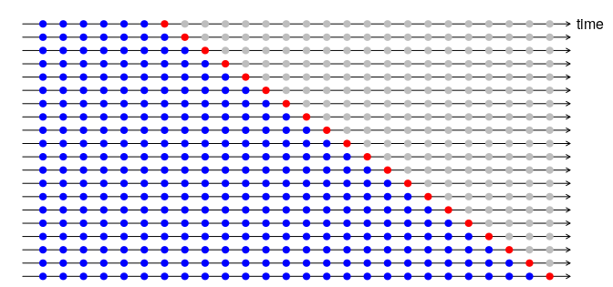

```{r echo=FALSE}
set.seed(12229)
```


A \textit{time series} is a sequence of observations in chronological order. The observations may be triggered by events, occuring at \textit{irregular intervals} (e.g. tick-by-tick data on stock price triggered by transactions; bank account deposits and withdrawals), or may be planned and occuring at \textit{regular intervals} (e.g. daily mean temperature). Other examples include monthly Consumer Price Index, mean daily temperature, monthly sea level pressures, monthly advertising costs, quarterly sales, monthly unemployment rates and monthly energy usage.

More formally, a time series is generally denoted by notations such as 
\begin{gather*}
  \lbrace y_t, t=1,2,\dots,n \rbrace, \\
  \lbrace y_1,\dots,y_n \rbrace, \\
  y = (y_1,\dots,y_n),
\end{gather*}
where we think of $y$ as realisations from a stochastic (random) process - a sequence of random variables characterised by a probability distribution function. Given a time series model with parameter $\theta$, we are interested in: \textit{descriptive inference} - estimating $\theta$; and \textit{predictive inference} - forecasting future observations $\lbrace y_{n+1},\dots,y_{n+q} \rbrace$.

\textit{Time series analysis} (TSA) is different from \textit{longitudinal data analysis} (LDA). In TSA, we have observations that pertain to the sequential behavior of a single subject or unitary entity (such as a person, country, financial instrument, etc.) and we are interested in intra-individual variation. Results do not generalise across some population of subjects but instead generalise across the time domain of this particular subject. In LDA, we study multiple subjects' outcome over time and are usually interested in separating out the intra- and inter-individual variability. Results can be generalised across the population from which the subjects were drawn.

Before we begin, let's load the relevant packages.
```{r message=FALSE, warning=FALSE}
library(forecast) # the main package for time series forecasting
library(urca) # unit root tests for stationarity
library(tidyverse) # ggplot2 and piping operator
library(quantmod) # get financial data from Google, Apple, FRED, etc., and tools for 
# plotting financial data
library(rdatamarket) # data access API for DataMarket.com (contains time series data 
# maintained by Rob Hyndman). URL: https://datamarket.com/data/list/?q=provider%3Atsdl
```


# Time Series Object in  R
The core data object data.frame in  R is not designed to work efficiently with time series data. For example, subsetting data based on a time index is not straightforward, and the default plotting methods in  R is not designed for handling time series data. Hence, there is a need for specicialised class in  R that comes with a rich set of methods for manipulating and plotting time series data.

The fundamental class is ts ("stats" package) that can represent \textit{regularly spaced} time series using numeric time stamps. It is particularly well-suited for annual, monthly, quarterly data, etc. A vector of observations can be turned into a ts object using the ts function
```{r}
y = ts(c(123,25,34,53,135), start=2012)
y
```

By default, ts assume that you have annual data, with one observation per year, so you only need to provide a starting year. The start argument can take either a single number or a vector of two integers. For observations that are more frequent than once per year, you can add a frequency argument. When using the ts() function in  R, use a value of frequency = $1, 4, 12$ and $52$ for annual, quarterly, monthly and weekly data, respectively. This is an example for monthly data that start on January 2012:
```{r}
y = ts(c(123,25,34,53,135,34,12,23,53,32,23,43,39,24,39,49,50,37,30,75,65,67,45,65),
        start=c(2012,1), end=c(2013,1),frequency=12)
y
```

We can also create ts objects that contain multiple series, by passing a matrix rather than a vector to the x argument of ts().
```{r fig.height=4}
seq = seq(from = 1, to = 100, by = 1) + 10
ts1 = seq + rnorm(100, sd = 5)
ts2 = seq + rnorm(100, sd = 15)
ts3 = seq^2 + rnorm(100, sd = 100)
ts = cbind(ts1, ts2, ts3)
ts = ts(ts, start=c(1990, 1), frequency = 4)
plot(ts)
```

When we call the plot() function on a ts object,  R automatically calls the plot.ts() function under the hood. You can verify this by using the plot.ts() function directly instead.

For handling more general irregularly spaced time series, the commonly used packages are "zoo" and "xts". The zoo and xts objects store time values in an index attribute displayed like a row name. xts is an extension of the zoo class that provides additional functionalities. Here are some resources:
\begin{enumerate}
\item DataCamp course on xts \& zoo. \\ https://www.datacamp.com/courses/manipulating-time-series-data-in-r-with-xts-zoo
\item xts cheat sheet. \\
https://www.datacamp.com/community/blog/r-xts-cheat-sheet
\end{enumerate}

Sometimes, you want to create training and test sets to test the accuracy of your forecast method, that is, you want to hide some observations at the end of a time series (test data) and try to forecast them using a model fitted to the training data. The window() function from the "stats" package can be used to extract a portion of a time series. Do not use the usual square bracket for subsetting time series data, as properties of the ts object will be lost. For example, the following code create a training set by extracting all data until the end of 2009 from ts1. Similarly, a test set is created by extracting all data from the beginning of 2010.
```{r fig.width=17}
ts1 = ts(ts1,start=c(1990,1),frequency=4)
training = window(ts1, end=c(2009,4))
test = window(ts1,start=c(2010,1))
```
The size of the test set is typically about 20\% of the total sample, although this depends on how factors such as the number of observations and how long ahead you want to forecast. The test set should ideally at least as large as the maximum forecast horizon required. In any case, it is important that the test set must not be used for any aspect of calculating forecasts, i.e. the model must not have "seen" the test data.


# Fundamental Concepts 


## Stationarity
The foundation for statistical inference in time series analysis is the concept of stationarity, which is a method to achieve parsimony (being able to accomplish a desired level of explanation or prediction with as few parameters as possible). You will see later that fitting an ARIMA model (one of the two most widely used approaches to time series forecasting, along with exponential smoothing) requires the series to be stationary.
 
A time series process is said to be \textit{strictly stationary} if ALL aspects (including quantiles, skewness, kurtosis) of its behavior are time invariant (unchanged by shifts in time). In other words, the time series is indistinguishable from a time-shifted version of itself. Mathematically, stationarity is defined as the requirement that for every $m$ and $n$, the distributions of $Y_1,\dots,Y_n$ and $Y_{1+m},\dots,Y_{n+m}$ are the same. This is a very strong assumption and it is very difficult to prove.

Strict stationarity is ideal, but often we can get around by assuming less, namely, \textit{weak stationarity}. A time series process is weakly stationary if its first two moments (mean and variance) are time invariant and the correlation between two observations depends only on the \textit{lag}, the time distance between them. For instance, if the process is weakly stationary, then the correlation between $Y_2$ and $Y_5$ is the same as the correlation between $Y_{10}$ and $Y_{13}$. Stationary processes can be modelled with relatively few parameters, for example, with a common expectation rather than a different one for each observations.

Many time series are not stationary, but the changes in the raw or log transformed observations are stationary. This is called differencing, i.e. compute the differences between consecutive observations. Transformations (e.g. log) help to stabilise the variance of a times series, while differencing can help stabilise the mean by removing changes in the level of a time series, therefore eliminating (or reducing) trend and seasonality. For example, returns on stocks or changes in the sales of products such as winter coats. Stock prices and sales quantity are expected to increase over the years and exhibit seasonal variations, but the changes, as defined by $Y_{t+1}-Y_t$ (or perhaps the log version), are often time invariant. 

\textbf{Unit root tests for stationarity}   
    
One can use the autocorrelation plot (see the subsection on ACF) to determine whether a series is stationary. Alternatively, one can use a more principled approach via the unit root tests. A number of unit root tests are available, which are based on different assumptions and may lead to conflicting answers. Here, we use the
\textit{Kwiatkowski-Phillips-Schmidt-Shin (KPSS) test}, implemented via the ur.kpss() function within the "urca" package.
```{r}
x = seq(1:100)
y = 50 + 5*x + rnorm(length(x),0,15)
#cos it's random, it will be different each time
y %>% ur.kpss() %>% summary()
```
```{r}
x = seq(1:100)
y = 50 + 5*x + rnorm(length(x),0,15)
y %>% ur.kpss() %>% summary()
```

The test statistic is much higher than the 1\% critical value, indicating that the null hypothesis is rejected, i.e. the data are not stationary. Let's explore whether differencing the data will result in a stationary series.
```{r}
y %>% diff() %>% ur.kpss() %>% summary()
```

By applying the test to the differenced data, we see that the test statistic is small, and well within the range we would expect for stationary data. So we can conclude that the differenced data are stationary. For more information, please refer to https://otexts.org/fpp2/stationarity.html.


## Autocorrelation Function (ACF)
Define $\gamma_k = \text{Cov}(y_t,y_{t+k})$ as the \textit{lag-k autocovariance}. Under a weakly stationary time series $y_t$, $\gamma_k$ is time invariant, i.e. $\gamma_k$ depends on $k$ only. Autocovariance has two important properties: (i) $\gamma_0 = \text{Var}(y_t)$ and (ii) $\gamma_{-k} = \gamma_{k}$.

Autocorrelation is the correlation of a variable against a time-shifted version of itself (the prefix "auto" means "self"), as opposed to \textit{correlation} which is a measure of the strength of linear dependence between two different variables. The \textit{lag-k autocorrelation} of a weakly stationary time series $y_t$ is defined as 
\begin{equation*}
\rho_k = \frac{\text{Cov}(y_t,y_{t+k})}{\sqrt{\text{Var}(y_t)\text{Var}(y_{t+k})}} = \frac{\text{Cov}(y_t,y_{t+k})}{\text{Var}(y_t)} = \frac{\gamma_k}{\gamma_0},
\end{equation*}
where $\text{Var}(y_{t+k}) = \text{Var}(y_{t})$ due to $y_t$ being weakly stationary. By definition, we have $\rho_0 = 1$, $\rho_l = \rho_{-l}$ and $-1 \leq \rho_t \leq 1$. The aurocorrelation function (ACF) $\lbrace \rho_k \rbrace$ is a collection of autocorrelations. A weakly stationary time series is not serially correlated if and only if $\rho_k = 0$ for all $k > 0$.

\textbf{Correlogram}   
     
\textit{Correlogram}, also known as an autocorrelation plot, is a plot of the sample autocorrelation versus the time lags. Apart from determining whether a series is stationary, autocorrelation plot can also help us to choose the order parameters for an ARIMA model (see the section on ARIMA). Autocorrelation plot can be useful in detecting time series patterns such as trend (slow decay in the ACF as the lags increase), seasonal and cyclic behaviours (an oscillation / "scalloped" shape).  Here are some resources for using correlogram to detect time series patterns:
\begin{enumerate}
\item Definitions of "trend", "seasonal" and "cyclic". \\ https://otexts.org/fpp2/tspatterns.html
\item Examples of using a correlogram to detect time series patterns. \\
https://otexts.org/fpp2/autocorrelation.html
\end{enumerate}

As an example, consider the following non-stationary time series and its associated autocorrelation plot. Notice the slow decrease in the ACF as the lags increase. You will learn more about the functions to plot the ACF later (in the subsection on white noise).
```{r fig.width=13}
x = seq(1:100)
y = 50 + 5*x + rnorm(length(x),0,15)
y = ts(y)
plot(y)
ggAcf(y) + ggtitle("ACF of a non-stationary time series") + theme_bw()
```

In contrast, here is an example of a stationary time series. Do not worry about the arima.sim() function at the moment, you will learn more about this in the ARIMA section. Notice that the ACF decreases to zero relatively quickly, which is indicative of a stationary time series.
```{r fig.width=13}
y = arima.sim(list(order=c(0,0,1),ma=c(0.5)),n=100)
plot(y)
ggAcf(y) + ggtitle("ACF of a stationary time series") + theme_bw()
```


## Partial Autocorrelation Function (PACF)
The partial autocorrelation at lag k is the correlation that results after removing the effect of any correlations due to the terms at shorter lags. Think of the autocorrelation for an observation and an observation at a prior time step as comprised of both the direct ("actual") and indirect (induced by observations at intervening time steps) correlations. The partial autocorrelation seeks to remove the indirect correlations. For example, the partial autocorrelation between $y_1$ and $y_5$ is the "actual" autocorrelation between these two observations after having removed the effect of $y_2$, $y_3$, and $y_4$ on $y_5$. The partial aurocorrelation function (PACF) $\lbrace \phi_k \rbrace$ is a collection of partial autocorrelations.

## White Noise (WN) 
White noise is the simplest example of a stationary process. A time series process is called a white noise if it is a sequence of independent and identical random variables with finite mean and variance. In particular, a \textit{Gaussian white noise} is a series that is normally distributed with mean $0$ and constant variance $\sigma^2$.

```{r fig.width=13}
y = ts(rnorm(100))
plot(y, main="Gaussian White Noise")
```

For white noise series, we expect each autocorrelation to be closed to $0$, i.e. no autocorrelation, due to the independence property. For a white noise series, we expect about $95\%$ of the spikes in the ACF to lie within $\pm 2/\sqrt{T}$, where $T$ is the length of the time series. In our case, we have $\pm 2/\sqrt{100} = \pm 0.2$. 

```{r fig.width=13}
acf(y,main="Gaussian White Noise")  # command to obtain sample ACF of the data
```

Note that the lag $0$ autocorrelation is fixed at $1$ by convention. Alternatively, you could also use the Acf() function within the "forecast" package. They produce essentially identical plots, except that the latter plot exclude the lag $0$ autocorrelation. 
```{r fig.width=13}
Acf(y, main="Gaussian White Noise")
```

There is also a ggplot equivalent of Acf within the "forecast" package, where you get access to the layer plotting facility:
```{r fig.width=13}
ggAcf(y) + ggtitle("Gaussian White Noise") + theme_bw()
```

\textbf{Portmanteau test for autocorrelation}    
   
Notice that most of all the autocorrelations lie within the 95% limits. Instead of looking at the ACF plot to see whether each spike is within the required limits (remember multiple testing?), a better way is to test whether the collection of first $h$ autocorrelations are significantly different from what would be expected from a white noise process using the \textit{portmanteau test}. One such test is the \textit{Ljung-Box test}, which is an improved version of the \textit{Box-Pierce test}. This can be implemented via the Box.test() function within the "stats" package.
```{r fig.width=13}
Box.test(y, lag=10, fitdf=0)    # Box-Pierce test
Box.test(y,lag=10, fitdf=0, type="Lj")    # Ljung-Box test
```
For both tests, the results are not significant, as the p-values are relatively large. Thus, we can conclude that the residuals are not distinguishable from a white noise series. Note that the option fitdf denotes the number of parameters in the model. In our example, fitdf = 0 since the test statistics are calculated from raw data rather than the residuals from a model). For an ARMA(p,q) fit (more on this in the next section), fitdf = p+q provided that h>fitdf. For more details, please refer to https://otexts.org/fpp2/residuals.html.


# ARIMA Models

ARIMA models aim to describe the autocorrelations in the data, and is one of the most widely used approaches to time series forecasting. For ARIMA models, the time series involved need to be weakly stationarity or being able to achieve weakly stationarity via differencing. You will learn about differencing later in the section.

ARIMA is an acronym that stands for AutoRegressive Integrated Moving Average. This acronym is descriptive, capturing the key aspects of the model itself:
\begin{enumerate}
  \item AR: Autoregression. A model that uses the dependent relationship between an observation and some number of lagged observations.
  \item I: Integrated. The use of differencing of raw observations (i.e. subtracting an observation from an observation at the previous time step) in order to make the time series stationary.
  \item MA: Moving Average. A model that uses the dependency between an observation and residual errors from a moving average model applied to lagged observations.
\end{enumerate}
Each of these components are explicitly specified in the model as a parameter.
A standard notation is ARIMA(p,d,q) where the parameters are substituted with integer values to indicate the specific ARIMA model being used. The parameters of the ARIMA model are defined as follows:
\begin{enumerate}
  \item p: The number of lag observations included in the model, also called the lag order.
  \item d: The number of times that the raw observations are differenced, also called the degree of differencing.
  \item q: The size of the moving average window, also called the order of moving average.
\end{enumerate}
   
We now discuss the components of an ARIMA model in detail.


## Autoregressive (AR) Process
An autoregressive process of order $p$, i.e. AR(p), is defined by 
\begin{equation*}
  Y_t = \mu + \alpha_1 y_{t-1} + \alpha_2 y_{t-2} + \dots + \alpha_p y_{t-p} + \epsilon_t,
\end{equation*}
where $\mu$ is the mean of the process, $\alpha_1,\dots,\alpha_p$ are the autoregressive coefficients and $\epsilon_t$ denotes white noise. The idea is to feed past data back into the current value of the process. This induces correlation between the past and the present. The effect is to have at least some correlation at \textit{all} lags.

We can generate an AR process using the arima.sim() function within the stats package. To use the arima.sim() function, you need to specify a model argument, which is a list comprising of:
\begin{enumerate}
  \item order: the order $(p,d,q)$.
  \item ar and/or ma: the AR and MA coefficients, respectively. An empty list gives an ARIMA(0,0,0) model. 
\end{enumerate}
The mean $\mu$ need to be added outside the function. Within the order component of the model, $p$ is the order of an AR process, $q$ is the order of a MA process, and $d$ is the degree of differencing.

For example, to generate an AR(2) process of the following: $Y_t = 50 + 0* y_{t-1} - 0.9 *  y_{t-2} + \epsilon_t$,
```{r fig.width=13}
ar2sim = arima.sim(list(order=c(2,0,0),ar=c(0,-0.9)),n=250) + 50
plot(ar2sim, main="AR(2) with mean 50")
```

An AR(p) process can be identified via an ACF that \textit{tails off} (decays to $0$) and a PACF that \textit{cuts off at lag $p$} (becomes $0$ abruptly). 

```{r fig.width=13}
ggAcf(ar2sim) + ggtitle("ACF of an AR(2) process") + theme_bw()
ggPacf(ar2sim) + ggtitle("PACF of an AR(2) process") + theme_bw()
```

\textbf{Parameter Estimation amd Model Diagnostics}    
Once we identified the order of an AR process, we can estimate the parameters $\alpha_1,\dots,\alpha_p$ using the Arima() function within the "forecast" package (a wrapper to the arima() function within the "stats" package).
```{r}
Arima(ar2sim,order=c(2,0,0))
```

Alternatively, you can also automate the search for an AR model using the auto.arima() function within the "forecast" package by optimising the one of the AICc, AIC and BIC criteria.
```{r}
ar2fit = auto.arima(ar2sim, max.p = 20, max.q = 20, ic = "aicc")
ar2fit
```

Have a look at https://otexts.org/fpp2/arima-r.html to understand the algorithm behind auto.arima(). In particular, have a look at Figure 1 taken from the same website. The auto.arima() function only takes care of Steps 3-5. Before you use the automatic algorithm, you have to deal with the variance and unusual observations if necessary. After a model is chosen, you have to manually check the residuals before computing forecasts. A good forecasting method will yield residuals with the following properties:
\begin{enumerate}
    \item The residuals are uncorrelated. If there are correlations between residuals, then there is information left in the residuals which should be used in computing forecasts.
    \item The residuals have zero mean. If the residuals have a mean other than zero, then the forecasts are biased.
\end{enumerate}

In addition to these essential properties, it is useful (but not necessary) for the residuals to also have the following two properties.
\begin{enumerate}
    \item The residuals have constant variance.
    \item The residuals are normally distributed.
\end{enumerate}
These two properties make the calculation of prediction intervals easier. Fore a forecasting method that does not satisfy these properties, an alternative approach to obtaining prediction intervals is necessary.


The checkresiduals() function within the "forecast" package allows us to check these assumptions.
```{r fig.width=13}
checkresiduals(ar2fit)
```

These graphs show that the chosen model produces forecasts that appear to account for all available information. 
\begin{enumerate}
  \item The mean of the residuals is close to zero.
  \item There is no significant correlation in the residuals series:
        \begin{enumerate}
          \item The ACF plot of the residuals from the model shows that almost all of the autocorrelations are within the threshold limits, indicating that the residuals are behaving like white noise. 
          \item A portmanteau test returns a p-value that is greater than 0.05, also suggesting that the residuals are white noise.
        \end{enumerate}
  \item The time plot of the residuals shows that the variation of the residuals stays much the same across the historical data.
  \item  The histogram suggests that the residuals appears to be normal. 
\end{enumerate}
Consequently, forecasts from this method will probably be quite good, and the  prediction intervals that are computed assuming a normal distribution is accurate.
 
 
\textbf{Forecasting}   
   
Now that we are convinced that the residuals look like white noise, we can proceed to calculating forecasts. This can be done using the predict.Arima() function within the "stats" package, but the forecast() function within the "forecast" package is preferred as it returns a forecast object that is useful for plotting. If the first argument of forecast() is of class ts, it returns forecasts from the automatic ETS (error, trend, seasonal / ExponenTial Smoothing) algorithm discussed in https://otexts.org/fpp2/ets.html.  This works quite well if you have no idea what sort of model to use, but now that we have fitted a model using the auto.arima() function, we can use the forecast() function to produce forecasts from the fitted model.
```{r fig.width=13}
ar2forecast = forecast(ar2fit)
summary(ar2forecast)
plot(ar2forecast)
```

In this particular scenario, the only way to evaluate the forecast accuracy is to wait for another 10 period of time for the observations to occur. A more efficient way is to split the data into training and test sets - fit the model to the training set and forecast using the test set. Forecasting accuracy on the test set can be assessed using a range of summary measures, obtained via the accuracy() function within the "forecast" package. For more details on these accuracy measures, type ?accuracy in R console, or visit this webpage https://otexts.org/fpp2/accuracy.html.

```{r}
ar2sim.train = window(ar2sim, end=200)
ar2sim.test = window(ar2sim, start=201)
fit = auto.arima(ar2sim.train)
test.arima = forecast(fit, h=50) 
accuracy(test.arima, ar2sim.test)
```

It is often a good idea to compare the forecasting accuracy of your chosen method with that of a set of simple forecasting methods:
\begin{enumerate}
  \item \textbf{Average method}: All forecasts are equal to the average of the historical data.
  \item \textbf{Naive method}: All forecasts are equal to the value of the last observation.
  \item \textbf{Drift method}: Allow the forecasts to increase of decrease over time, where the amount of change over time (drift) is set to be the average change seen in the historical data. This is equivalent to drawing a line between the first and last observations, and extrapolating it into the future.
\end{enumerate}
 
```{r}
test.average = meanf(ar2sim.train,h=50)   # Average method ("forecast" package)
test.naive = rwf(ar2sim.train,h=50)   # Naive method ("forecast" package)
test.drift = rwf(ar2sim.train,drift=TRUE,h=50)   # Drift method ("forecast" package)
result = rbind(accuracy(test.arima, ar2sim.test)[2,c(2,3,5,6)],
               accuracy(test.average, ar2sim.test)[2,c(2,3,5,6)],
               accuracy(test.naive, ar2sim.test)[2,c(2,3,5,6)],
               accuracy(test.drift, ar2sim.test)[2,c(2,3,5,6)])
rownames(result) = c("ARIMA","Average","Naive","Drift")
result
```
All results point to the ARIMA model as the best compared to the simple forecasting methods. Note that if your chosen method cannot outperform the simple forecasting methods, then must well you use the simple method (remember the principle of Occam's razor?). Also, different accuracy measures may lead to different results as to which forecast method is best, although it is not the case in this particular example. For more details, refer to https://otexts.org/fpp2/simple-methods.html.

The following figure shows the ARIMA model and the three simple forecasting methods applied to the time series. It is clear that the ARIMA model outperforms the simple forecasting methods. 
```{r}
autoplot(ar2sim) + 
  autolayer(test.arima, PI=FALSE, series="ARIMA") + 
  autolayer(test.average, PI=FALSE, series="Average") + 
  autolayer(test.naive, PI=FALSE, series="Naive") + 
  autolayer(test.drift, PI=FALSE, series="Drift") + 
  ggtitle("Forecasts for an AR(2) series") +
  guides(colour=guide_legend(title="Forecast")) +
  theme_bw()
```


A more sophisticated version of training / test sets is \textit{cross-validation} (CV). The classic CV for independent data works as follow:
\begin{enumerate}
  \item Select one observation as the test set, and use the remaining observations in the training set. Compute error on the test observation.
  \item Repeat using each possible observation as the test set.
  \item Compute accuracy measure over all errors.
\end{enumerate}

However, this does not work for time series because we cannot use future observations to build a model - it just does not make sense. A slight modification can be made to the 
classic CV method, where the corresponding training set consists only of observations that occurred prior to the observation that forms the test set. This procedure is sometimes known as “evaluation on a rolling forecasting origin” because the “origin” at which the forecast is based rolls forward in time. Refer to Figure 2 (taken form https://otexts.org/fpp2/accuracy.html) for an illustration.


Time series cross-validation is implemented with the tsCV() function within the "forecast" package. You need to supply a forecastfunction in the second argument of tsCV(). For more information, type ?tsCV in the R Console. In the following, we compute the root mean squared error (RMSE) obtained via cross validation.
```{r}
forecastfn = function(y, h){forecast(auto.arima(y), h=h)}
e = tsCV(ar2sim, forecastfn, h=1)
sqrt(mean(e^2, na.rm=TRUE))   # RMSE (CV)
```
 
The calculation implements a one-step time series CV where the model and parameters are re-estimated at every forecast origin. 
A good way to choose the best forecasting model is to find the model with the smallest RMSE computed using time series cross-validation. Sometimes a multi-step forecasts may be more relevant. For more information, refer to https://otexts.org/fpp2/accuracy.html.

## Moving Average (MA) Process
A moving average process of order $q$, i.e. MA(q) is defined by 
\begin{equation*}
  Y_t = \mu + \epsilon_t + \beta_1 \epsilon_{t-1} + \beta_2 \epsilon_{t-2} + \dots + \beta_q \epsilon_{t-q},
\end{equation*}
where $\mu$ is the mean of the process, $\beta_1,\dots,\beta_p$ are the autoregressive coefficients and the $\epsilon_t$ are white noise.

For example, to generate an MA(1) process of the following: $Y_t = 30 + \epsilon_t + 0.9* \epsilon_{t-1}$,
```{r fig.width=13}
ma1sim = arima.sim(list(order=c(0,0,1),ma=c(0.9)),n=250) + 30
plot(ma1sim, main="MA(1) with mean 30")
```

A MA(q) process can be identified via an ACF that \textit{cuts off at lag $q$} and a PACF that \textit{tails off}. 
```{r fig.width=13}
ggAcf(ma1sim) + ggtitle("ACF of a MA(1) process") + theme_bw()
ggPacf(ma1sim) + ggtitle("PACF of a MA(1) process") + theme_bw()
```

We can also automate the search for an MA model.
```{r message=FALSE, warning=FALSE}
ma1fit = auto.arima(ma1sim, max.p = 20, max.q = 20, ic = "aicc")
ma1fit
```


## Autoregressive Moving Average (ARMA) Process
An autoregressive moving average process, i.e. ARMA(p,q) combines both AR(p) and MA(q) and is defined by 
\begin{equation*}
  Y_t = \mu + \alpha_1 y_{t-1} + \alpha_2 y_{t-2} + \dots + \alpha_p y_{t-p} + \epsilon_t + \beta_1 \epsilon_{t-1} + \beta_2 \epsilon_{t-2} + \dots + \beta_q \epsilon_{t-q}.
\end{equation*}

It shows how $Y_t$ depends on the lagged values of itself and also the lagged values of the white noise process. To generate an ARMA(2,1) process of the following: $Y_t = 30 + 0.1*y_{t-1} - 0.8*y_{t-2} + \epsilon_t + 0.9* \epsilon_{t-1}$,
```{r fig.width=13}
arma21sim = arima.sim(list(order=c(2,0,1),ar=c(0.1,-0.8),ma=c(0.9)),n=250) + 30
plot(arma21sim, main="ARMA(2,1) with mean 30")
```

An ARMA(p,q) process can be identified via ACF and PACF that both \textit{tails off}. 
```{r fig.width=13}
ggAcf(arma21sim) + ggtitle("ACF of an ARMA(2,1) process") + theme_bw()
ggPacf(arma21sim) + ggtitle("PACF of an ARMA(2,1) process") + theme_bw()
```

We can also automate the search for an ARMA model.
```{r message=FALSE, warning=FALSE}
arma21fit = auto.arima(arma21sim, max.p = 20, max.q = 20, ic = "aic")
arma21fit
```


## Autoregressive Integrated Moving Average (ARIMA) Process
Denote $\Delta = 1 - B$ as the "\textit{difference operator}", where $B$ is the "\textit{backshift operator}" defined by $B Y_t = Y_{t-1}$, and more generally, $B^k Y_t = Y_{t-k}$. As a consequence, applying $\Delta$ on $Y_t$ results in
\begin{equation*}
  \Delta Y_t = (1-B)Y_t = Y_t - Y_{t-1}.
\end{equation*}

Differencing can be iterated. For example, 
\begin{equation*}
  \Delta^2 Y_t = \Delta (\Delta Y_t) = \Delta (Y_t - Y_{t-1}) = (Y_t - Y_{t-1}) - (Y_{t-1} - Y_{t-2}) = Y_t - 2Y_{t-1} + Y_{t-2}.
\end{equation*}

A time series process is said to be autoregressive integrated moving average ARIMA(p,d,q) process if $\Delta^d Y_t$ is ARMA(p,q). For example, if the difference in prices are ARMA(p,q), then the prices are ARIMA(p,1,q). Note that an ARIMA(p,0,1) model is the same as an ARMA(p,q) model. ARIMA(p,0,0), ARMA(p,0) and AR(p) models are the same. Similarly, ARIMA(0,0,q), ARMA(0,q) and MA(q) models are the same.


# Outlook

This workbook aims to provide an overview of time series forecasting, with an emphasis on ARIMA models. It is by no means a comprehensive tutorial on all aspects of time series forecasting. There are important topics (such as seasonal data and exponential smoothing) that are not covered by this workbook. 

Here, I provide links to further resources:
\begin{enumerate}
  \item If there is a single book on time series forecasting that I would recommend, it would definitely be this one (freely available online): https://otexts.org/fpp2/. It is writen by Rob Hyndman and George Athanasopoulos from Monash University. The data sets required for the examples and exercises in the book are available via the "fpp" package. When you load the "fpp" package, all required packages (most notably the "forecast" package) to run the examples are also loaded. In fact, a lot of materials from this workbook are taken from this book.
    \item Here is an excellent talk on intro to time series forecasting given by Rob Hyndman:      
    https://robjhyndman.com/seminars/melbournerug/. There is also a link to the slides. 
    \item Here is a nice tutorial that covers ARIMA model https://www.datascience.com/blog/introduction-to-forecasting-with-arima-in-r-learn-data-science-tutorials.
  \item Here is a nice tutorial that covers important concepts such as seasonal data and exponential smoothing (that not covered in this workbook): https://a-little-book-of-r-for-time-series.readthedocs.io/en/latest/src/timeseries.html.
  \item A nice introduction to extracting seasonality and trend from data: https://anomaly.io/seasonal-trend-decomposition-in-r/.
  \item DataCamp has a time series track: https://www.datacamp.com/tracks/time-series-with-r. In fact, one of the courses https://www.datacamp.com/courses/forecasting-using-r is given by Rob Hyndman based on his book.
  \item An online course on applied time series analysis by PennState Eberly College of Science:  https://onlinecourses.science.psu.edu/stat510/node/41.
  \item For a comprehensive lists of \text{R} packages for time series modelling, refer to the following CRAN Task View maintained by Rob Hyndman: https://cran.r-project.org/web/views/TimeSeries.html.
\end{enumerate}

I conclude the workbook by providing an overview on some miscellaneous topics that are potentially useful.


## Obtaining Financial Data using the "quantmod" package: Daily Apple Stock Price 2010-2016
"quantmod" is a useful package that allows users to download financial data directly from Yahoo Finance, Google Finance, Federal Reserve Economic Data (FRED) of Federal Reserve Bank of St. Louis, Oanda, etc. The package also comes with nice functionalities to visualise financial time series. 

To download the daily prices of Apple stock from Yahoo (the default - you can change the source by using the src argument):
```{r message=FALSE, warning=FALSE}
getSymbols("AAPL",from="2010-01-01",to="2014-12-31")
dim(AAPL)
head(AAPL)
```

Each call of getSymbols() results in the data being loaded directly into your workspace, with the name of the object (AAPL in this case) returned from the call. To produce a time series plot of closing price and trading volume (the default background is black, so we use the theme argument to change the colour of the background):

```{r fig.width=13}
chartSeries(AAPL,theme="white")
```

Note that the closing price is not stationary, but we can turn the series into a stationary process by taking the first difference. From the following plot, it is seen that the returns fluctuate around $0$ and, except for a few extreme values, are within a fixed range.
```{r fig.width=13}
plot(diff(AAPL$AAPL.Close), main="Apple Stock Returns")
```

We can also download multiple symbols in one go. To download daily stock prices of Apple, Amazon and Microsoft:
```{r}
getSymbols("AAPL;AMZN;MSFT")
```

Note that we did not specify the period, so the stock prices is retrieved up to the date you run the command.


## Seasonal time series: Monthly Airline Passenger Numbers 1949-1960
This is the classic Box \& Jenkins airline data that is included as built-in data sets within  R.
```{r fig.width=13}
passenger = AirPassengers
plot(AirPassengers, ylab="Passengers (1000s)", main="Air Passengers")
```
Based on the plot, the series is not stationary. Besides an overall upward trend, the numbers also exhibit a clear annual pattern, referred to as \textit{seasonality}. Moreover, seasonal variability appears to increase with the general trend, suggesting a multiplicative model rather than an additive model:
\begin{equation*}
  Y(t) = T(t)*S(t)*e(t)
\end{equation*}
where $Y(t)$ is the number of passengers at time $t$; $T(t)$, $S(t)$ and $e(t)$ are the trend, seasonal and random error component, respectively, at time $t$.

The data can be decomposed into its trend, seasonal and random error components:
```{r fig.height=4}
passenger.decompM = decompose(passenger, type="multiplicative") 
plot(passenger.decompM)
```

You may view the passenger.decompM object and check that the seasonal, trend and random components multiplied together to give you the original series. Refer to the following links for further analysis on this dataset:
\begin{enumerate}
  \item https://rpubs.com/nohaelprince/47545
  \item https://rpubs.com/emb90/137525
\end{enumerate}


## Packages that Contain Time Series Data
Rob Hyndman, a Professor of Statistics at Monash University has a collection of about 800 time series that he has maintained since about 1992, which can be accessed via https://datamarket.com/data/list/?q=provider%3Atsdl. These data can be read directly into  R using the "rdatamarket"" package. For example, to download "Mean monthly temperature, 1907 - 1972":
```{r message=FALSE, warning=FALSE}
temp = dmseries("https://datamarket.com/data/set/22o4/mean-monthly-temperature-1907-1972#!ds=22o4&display=line")
```

The data is set to zoo class. To convert it to ts class:
```{r fig.width=13}
temp = as.ts(temp[,1])
```

There is also the "tscompdata" package that contains several large collections of time series that have been used in forecasting competitions (NN3, NN5, NGC1, GEFCom2012). The "Mcomp" and "Tcomp" packages (containing other forecasting competition data) are also loaded when you load the "tscompdata" package. For more information, refer to https://robjhyndman.com/hyndsight/tspackages/.


